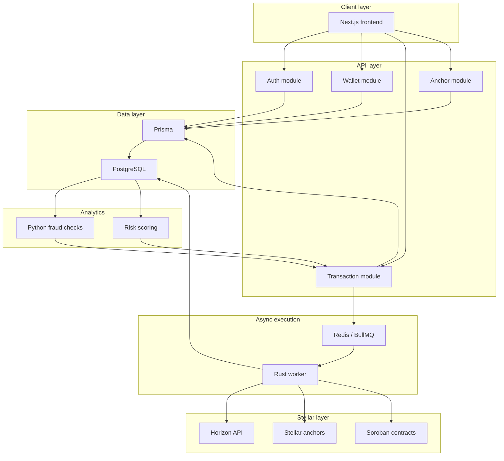

# AfroPay-Stellar Architecture

AfroPay-Stellar separates the product surface, API orchestration, blockchain execution, analytics, and persistence layers so each part can scale and be reviewed independently.

## Service Map

## Data Flow

1. A user signs in and starts a transfer from the Next.js frontend.
2. The NestJS API validates the request, loads wallet/account state, and writes an initial transfer record through Prisma.
3. Transfer simulation checks balances, trustlines, routing assumptions, and local exchange-rate constraints before live settlement.
4. Accepted transfers are queued in Redis/BullMQ so the HTTP request path stays fast.
5. The Rust worker consumes the job, builds Stellar operations, submits them to Horizon or Soroban, and writes the resulting hash/status.
6. Python analytics reads transaction history and emits fraud/risk signals that the API can use for monitoring, alerts, or future policy decisions.
7. The frontend polls or refreshes API state to show the final settlement status.

## Storage And Messaging

- PostgreSQL stores durable user, wallet, transfer, audit, and settlement state.
- Redis stores queue state, retry metadata, and short-lived coordination data.
- The API owns validation and persistence boundaries; workers own external network execution.

## Stellar Interaction Points

- The wallet service tracks Stellar account and trustline state.
- The transaction service prepares payment intent and simulation data.
- The Rust worker performs Horizon/Soroban calls, including path payments, anchor-driven flows, and future contract interactions.
- Anchor flows are exposed through the API but settle through Stellar-compatible rails.
