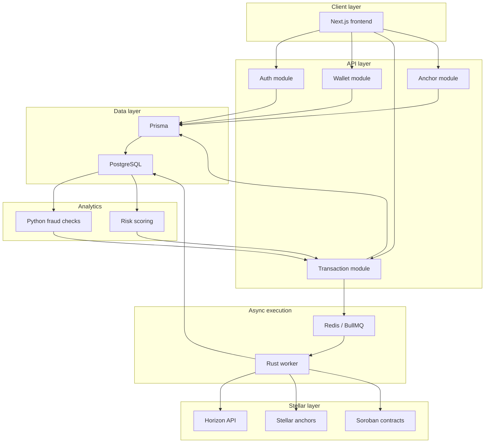

# AfroPay-Stellar Architecture

AfroPay-Stellar separates the product surface, API orchestration, blockchain execution, analytics, and persistence layers so each part can scale and be reviewed independently.

## Service Map

```mermaid
flowchart TB
  subgraph client["Client layer"]
    web["Next.js frontend"]
  end

  subgraph api["API layer"]
    auth["Auth module"]
    wallet["Wallet module"]
    transactions["Transaction module"]
    anchors["Anchor module"]
  end

  subgraph async["Async execution"]
    redis["Redis / BullMQ"]
    worker["Rust worker"]
  end

  subgraph intelligence["Analytics"]
    fraud["Python fraud checks"]
    risk["Risk scoring"]
  end

  subgraph data["Data layer"]
    db["PostgreSQL"]
    prisma["Prisma"]
  end

  subgraph stellar["Stellar layer"]
    horizon["Horizon API"]
    anchorsNet["Stellar anchors"]
    soroban["Soroban contracts"]
  end

  web --> auth
  web --> wallet
  web --> transactions
  web --> anchors
  auth --> prisma
  wallet --> prisma
  transactions --> prisma
  anchors --> prisma
  prisma --> db
  transactions --> redis
  redis --> worker
  worker --> horizon
  worker --> anchorsNet
  worker --> soroban
  worker --> db
  db --> fraud
  db --> risk
  fraud --> transactions
  risk --> transactions
```

## Data Flow

1. A user signs in and starts a transfer from the Next.js frontend.
2. The NestJS API validates the request, loads wallet/account state, and writes an initial transfer record through Prisma.
3. Transfer simulation checks balances, trustlines, routing assumptions, and local exchange-rate constraints before live settlement.
4. Accepted transfers are queued in Redis/BullMQ so the HTTP request path stays fast.
5. The Rust worker consumes the job, builds Stellar operations, submits them to Horizon or Soroban, and writes the resulting hash/status.
6. Python analytics reads transaction history and emits fraud/risk signals that the API can use for monitoring, alerts, or future policy decisions.
7. The frontend polls or refreshes API state to show the final settlement status.

## Storage And Messaging

- PostgreSQL stores durable user, wallet, transfer, audit, and settlement state.
- Redis stores queue state, retry metadata, and short-lived coordination data.
- The API owns validation and persistence boundaries; workers own external network execution.

## Stellar Interaction Points

- The wallet service tracks Stellar account and trustline state.
- The transaction service prepares payment intent and simulation data.
- The Rust worker performs Horizon/Soroban calls, including path payments, anchor-driven flows, and future contract interactions.
- Anchor flows are exposed through the API but settle through Stellar-compatible rails.

## Architecture Decision Records

AfroPay-Stellar's foundational design choices are documented as Architecture Decision Records (ADRs) in the [`docs/adr/`](./adr/) directory. Each ADR explains the "why" behind major decisions:

- **[ADR 0001: BullMQ for Asynchronous Settlement](./adr/0001-bullmq-async-settlement.md)** — Why we queue transfers in BullMQ instead of synchronously calling Stellar. Enables fast API responses and reliable retry logic.

- **[ADR 0002: AES-256-GCM Envelope Encryption](./adr/0002-aes256-gcm-envelope-encryption.md)** — Why we use hybrid envelope encryption for wallet secrets instead of pure KMS. Balances performance, availability, and security.

- **[ADR 0003: Python for Fraud Scoring](./adr/0003-python-fraud-scoring.md)** — Why fraud detection runs in Python rather than Rust or TypeScript. Prioritizes data science flexibility and ecosystem maturity.

- **[ADR 0004: Soroban Escrow Over SEP-8 Regulated Assets](./adr/0004-soroban-escrow-over-sep8.md)** — Why we implement settlement via Soroban smart contracts. Provides trustless, atomic settlement without issuer dependency.

- **[ADR 0005: Deterministic Keypair Derivation](./adr/0005-deterministic-keypair-derivation.md)** — Why the worker derives keys deterministically from a master seed. Ensures recovery and eliminates key-storage risk.

See the [ADR README](./adr/README.md) for details on how to propose new ADRs.
