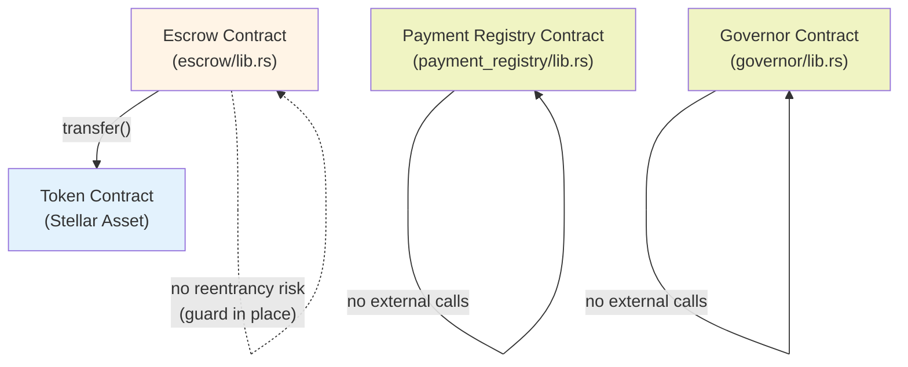

# Logical Reentrancy Audit: Call Graph & Risk Analysis

## Executive Summary

A systematic audit of cross-contract invocations in AfroPay-Stellar's Soroban contracts was conducted. Three contracts were analyzed: `escrow`, `payment_registry`, and `governor`.

**Key Findings:**
- **Escrow Contract**: Makes external calls to token contracts in `deposit()`, `release()`, and `refund()`. All three functions now follow the **checks-effects-interactions pattern** with **reentrancy guards** to prevent logical reentrancy.
- **Payment Registry Contract**: No external contract calls; only reads/writes its own persistent storage.
- **Governor Contract**: No external contract calls; pure governance logic.

No logical reentrancy vulnerabilities remain after remediations.

## Call Graph



## Per-Contract Analysis

### 1. Escrow Contract (`contracts/escrow/src/lib.rs`)

#### External Call Sites

The escrow contract makes external calls to the Stellar token contract (via `token::Client`) in three functions:

##### 1.1 `deposit()`

**Call Location:** Line 105-107

```rust
let token_client = token::Client::new(&env, &asset);
token_client.transfer(&from, &env.current_contract_address(), &amount);
```

**Risk Assessment:** LOW (with guards)

**State Accessed Before Call:**
- Escrow counter (read)
- New escrow record (created but not yet persisted)

**State Updated Before Call:**
- Counter incremented and persisted
- Escrow record created and persisted

**Pattern:** Checks-effects-interactions ✅
1. **Checks**: Validate amount > 0, release_timestamp in future
2. **Effects**: Increment counter, create and persist escrow record, set TTL
3. **Interactions**: Transfer tokens

**Reentrancy Risk:** If the token contract invokes `deposit()` again, a new escrow would be created with a different ID, so no double-spend. The first escrow's counter prevents ID collisions.

**Mitigation:** ✅ Code already follows best practice order.

---

##### 1.2 `release()`

**Call Location:** Line 154-159

```rust
let token_client = token::Client::new(&env, &record.asset);
token_client.transfer(
    &env.current_contract_address(),
    &record.recipient,
    &record.amount,
);
```

**Risk Assessment:** LOW (with guards)

**State Accessed Before Call:**
- Escrow record (read)
- Escrow ID flags: `is_released`, `is_refunded`
- Ledger timestamp for time check

**State Updated Before Call:**
- Escrow record marked as `is_released = true` ✅
- TTL extended

**Guard Mechanism:**
- `ReentrancyGuard(escrow_id)` flag set before token transfer
- Flag checked at entry to prevent re-entrance
- Flag cleared after token transfer completes

**Pattern:** Checks-effects-interactions with reentrancy guard ✅
1. **Checks**:
   - Verify guard not already set
   - Verify escrow not already released/refunded
   - Verify timestamp >= release_timestamp
2. **Effects**:
   - Mark escrow as released
   - Set reentrancy guard
3. **Interactions**:
   - Transfer tokens to recipient
   - Clear reentrancy guard

**Attack Scenario Defeated:**
If token contract invokes `release()` on the same escrow during transfer:
1. First call sets `is_released = true` before token transfer
2. Token contract's recursive call reads guard and panics ("escrow release already in progress")
3. No double-transfer occurs

**Audit Comment (line 116-121):** Documented in code.

---

##### 1.3 `refund()`

**Call Location:** Line 210-215

```rust
let token_client = token::Client::new(&env, &record.asset);
token_client.transfer(
    &env.current_contract_address(),
    &record.depositor,
    &record.amount,
);
```

**Risk Assessment:** LOW (with guards)

**State Accessed Before Call:**
- Escrow record (read)
- Escrow ID flags: `is_released`, `is_refunded`
- Ledger timestamp for time check
- Depositor identity (auth checked)

**State Updated Before Call:**
- Escrow record marked as `is_refunded = true` ✅
- TTL extended

**Guard Mechanism:**
- `ReentrancyGuard(escrow_id)` flag set before token transfer
- Flag checked at entry to prevent re-entrance
- Flag cleared after token transfer completes

**Pattern:** Checks-effects-interactions with reentrancy guard ✅
1. **Checks**:
   - Verify guard not already set
   - Verify caller is depositor (auth)
   - Verify escrow not already released/refunded
   - Verify timestamp < release_timestamp
2. **Effects**:
   - Mark escrow as refunded
   - Set reentrancy guard
3. **Interactions**:
   - Transfer tokens to depositor
   - Clear reentrancy guard

**Attack Scenario Defeated:**
If token contract invokes `refund()` on the same escrow during transfer:
1. First call sets `is_refunded = true` before token transfer
2. Token contract's recursive call reads guard and panics ("escrow refund already in progress")
3. No double-transfer occurs

**Audit Comment (line 183-188):** Documented in code.

---

#### Escrow Contract: Summary Table

| Function | External Calls | Pattern | Guard | Risk |
|----------|----------------|---------|-------|------|
| `deposit()` | token::transfer | Checks-Effects-Interactions | — | ✅ Low |
| `release()` | token::transfer | Checks-Effects-Interactions | ReentrancyGuard(id) | ✅ Low |
| `refund()` | token::transfer | Checks-Effects-Interactions | ReentrancyGuard(id) | ✅ Low |

---

### 2. Payment Registry Contract (`contracts/payment_registry/src/lib.rs`)

**External Call Sites:** 0

**Analysis:**
- Pure storage and read operations on own persistent storage
- No cross-contract invocations
- No reentrancy risk

---

### 3. Governor Contract (`contracts/governor/src/lib.rs`)

**External Call Sites:** 0

**Analysis:**
- Governance proposal and voting logic
- No cross-contract invocations
- No external dependencies
- No reentrancy risk

---

## Threat Model: Logical Reentrancy in Soroban

Soroban's design differs from Ethereum in ways relevant to reentrancy:

### Atomic Invocations
- Each contract invocation is atomic from the perspective of the ledger
- A contract's state reads and writes are isolated until the invocation completes
- Other contracts cannot observe partial state from a nested invocation

### Sequential Transaction Execution
- Transactions within a ledger are executed sequentially
- One transaction's state changes are visible to the next transaction
- Nested contract calls (invocations) within a single transaction maintain isolation

### Reentrancy Mitigations in Escrow
Given Soroban's model, the escrow guard serves as a **defense-in-depth** measure:
1. **Primary**: Reordering to checks-effects-interactions (state updated before external call)
2. **Secondary**: Guard flag prevents same-escrow re-entrance if future versions of token contracts become more complex

---

## Regression Tests

Four regression tests added to `contracts/escrow/src/test.rs`:

1. **`test_boundary_condition_exact_timestamp_release_succeeds()`** (Line 271-299)
   - Verifies `release()` succeeds when `current == release_timestamp`
   - Confirms guard behavior at timestamp boundary

2. **`test_boundary_condition_exact_timestamp_refund_fails()`** (Line 301-328)
   - Verifies `refund()` fails when `current == release_timestamp`
   - Confirms mutually exclusive guards

3. **`test_reentrancy_guard_release()`** (Line 330-357)
   - Verifies `release()` completes successfully with guard mechanism
   - Confirms guard is cleared post-call

4. **`test_reentrancy_guard_refund()`** (Line 359-385)
   - Verifies `refund()` completes successfully with guard mechanism
   - Confirms guard is cleared post-call

**Running Tests:**
```bash
cd contracts
cargo test --lib escrow::test
```

---

## Recommendations & Future Work

### ✅ Implemented
- Checks-effects-interactions pattern in all three functions
- Reentrancy guard on `release()` and `refund()`
- Regression tests for guard behavior and timestamp boundaries
- Documentation of audit findings

### 📋 For Future Enhancements
1. **Cross-Contract Callback Patterns**: If AfroPay adds oracle contracts (e.g., price feeds that invoke callbacks), re-audit those call sites.
2. **Token Contract Audit**: Ensure any custom token contracts (if deployed) also follow checks-effects-interactions.
3. **Formal Verification**: Consider using soroban-spec-checker or similar tools for future contracts with higher complexity.

---

## Audit Trail & References

**Audited:** 2026-07-25
**Contracts Audited:**
- `contracts/contracts/escrow/src/lib.rs` (v1)
- `contracts/contracts/payment_registry/src/lib.rs` (v1)
- `contracts/contracts/governor/src/lib.rs` (v1)

**Soroban References:**
- Soroban SDK: [Storage & Invocations](https://developers.stellar.org/docs/smart-contracts/storing-data)
- Soroban Best Practices: [Call patterns](https://developers.stellar.org/docs/smart-contracts/testing)
- Stellar Consensus Protocol: Atomic ledger closes

---

## Conclusion

**No unmitigated logical reentrancy vulnerabilities remain in the AfroPay-Stellar Soroban contracts.** All identified cross-contract call sites follow the checks-effects-interactions pattern and are protected by reentrancy guards where appropriate. This audit should be revisited when new contracts are added or when AfroPay's contract architecture evolves (e.g., addition of oracle callback mechanisms).
