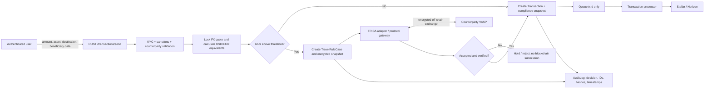

# FATF Travel Rule Design

**Status:** Design proposal; no protocol integration is implemented by this document.

**Scope:** NGN to USD and USD to NGN cross-border transfers initiated through AfroPay-Stellar. This document describes the FATF baseline and the application changes needed to comply. It is not legal advice; the compliance owner must confirm the rules in each licensed jurisdiction before launch.

## 1. Regulatory Baseline

FATF Recommendation 16 and its Interpretive Note require a Virtual Asset Service Provider (VASP) to obtain, retain and transmit originator and beneficiary information for a virtual-asset transfer at or above the applicable threshold. The FATF baseline used for this design is **USD 1,000 or EUR 1,000, or the local-currency equivalent**. The threshold is applied to the transfer value, not to the user's daily limit, and must be evaluated before the transfer is released.

The local-equivalent calculation must use a recorded, approved FX source and the rate timestamp used at decision time. A transfer must not be split, retried, or routed through multiple payments to avoid the threshold. Where a local rule is stricter than the FATF baseline, the stricter rule applies. Transfers below the threshold still require risk-based controls and records; they are not automatically exempt from AML monitoring.

### Corridor threshold matrix

| Corridor / transfer value | Travel Rule trigger for this design | Conversion and control requirement |
|---|---:|---|
| NGN -> USD | NGN equivalent of USD 1,000 | Convert the NGN amount to USD using the locked rate at submission. Do not use the user's display rate after submission. |
| USD -> NGN | USD 1,000 | Apply to the USD value sent, before any fee treatment defined by the compliance policy. Record gross amount, fee, net amount, currency and rate. |
| EUR-denominated value or EUR local equivalent | EUR 1,000 | Treat EUR as a supported regulatory comparison currency even if EUR is not currently a product asset. Store the EUR comparison value when the originating or destination jurisdiction requires it. |

The application currently normalizes amounts to USD in `KycService.normalizeAmountToUsd`. That value is useful for a first implementation, but it is not sufficient as the legal record: the transaction must also retain the source currency, rate provider, rate timestamp, and the policy version used to make the decision. The threshold configuration must be versioned and jurisdiction-aware rather than hard-coded as a UI constant.

### Information required

For an in-scope transfer, collect and validate before release:

- Originator: legal name, account or wallet identifier, physical address or date/place of birth as required by the applicable rule, and the user's VASP/customer identifier.
- Beneficiary: legal name, account or wallet identifier, and beneficiary VASP/customer identifier where the beneficiary uses a VASP.
- Transfer context: amount and asset, source and destination jurisdiction, originating and beneficiary VASP, threshold decision, timestamp, and a correlation ID.

The originator and beneficiary data must be accurate and protected. Do not put raw PII in Redis/BullMQ jobs or Stellar memos. The on-chain transaction should contain only the minimum product-required reference, if any; the Travel Rule exchange occurs off-chain.

### VASP identification

AfroPay-Stellar must identify itself and its regulatory perimeter before selecting a counterparty protocol: legal entity, country of registration, licensing/registration status, regulator, legal name, domain, operational contact, and a stable VASP identifier. For each counterparty, store the same fields plus the source and verification time. A Stellar public key is an on-chain address, not proof that its owner is a VASP or that the VASP is licensed.

For self-hosted or unhosted wallets, the counterparty VASP may be absent. The compliance policy must define the enhanced due diligence, sanctions screening, evidence collection, and approval path for those transfers. The protocol adapter must not silently label an unhosted wallet as a VASP.

## 2. Protocol Evaluation

| Option | Strengths | Constraints for AfroPay-Stellar | Assessment |
|---|---|---|---|
| **TRISA** | Open protocol and reference ecosystem; uses authenticated VASP identities and encrypted peer-to-peer exchange; supports discovery and certificate-based trust. | Requires TRISA identity/certificate operations, directory participation, and counterparty connectivity. Operational setup is heavier than a simple API integration. | Strong interoperability and governance choice where counterparties already participate. |
| **OpenVASP** | Open standards and tooling from the OpenVASP Association; a comparatively direct peer-to-peer model and useful reference implementation. | Adoption and counterparty reach must be verified per corridor; governance, discovery, and identity arrangements still need to be operated. | Good open alternative, but corridor coverage is an open dependency. |
| **Sygna Bridge** | Managed network and API-oriented integration can reduce time to connect to multiple VASPs; vendor handles parts of network operations. | Commercial dependency, pricing and data-processing terms; onboarding and coverage are vendor-specific; portability and exit need contractual treatment. | Practical if Nigerian and US counterparties are already reachable on the network and procurement approves it. |

### Recommendation: TRISA-compatible adapter, subject to counterparty coverage

Select **TRISA** as the protocol target for the first adapter. It best fits a design that needs verifiable VASP identity, encrypted exchange, and an open protocol rather than coupling the core transaction system to a single commercial network. The protocol choice is conditional: before implementation, the compliance and partnerships teams must confirm that the actual NGN and USD corridor counterparties can exchange through TRISA. If the required counterparties cannot, use Sygna Bridge as the managed transport behind the same internal adapter contract; do not change the transaction or Prisma model around a vendor-specific payload. OpenVASP remains the fallback for counterparties that support it.

The internal interface should therefore be protocol-neutral:

```text
TravelRuleAdapter.prepareAndExchange(snapshot, counterparty):
  -> ACCEPTED | PENDING | REJECTED | UNAVAILABLE
```

The adapter owns protocol serialization, encryption, identity discovery, retries, timeouts, and response verification. The transaction service owns the release decision and never trusts a client-provided `travelRuleStatus`.

## 3. Proposed Data Flow



### Lifecycle

1. The API authenticates the user and validates the beneficiary fields. KYC must provide the originator record; the client must not be able to override it.
2. The service obtains a locked FX quote and computes the NGN, USD, and applicable EUR equivalents. It creates a compliance snapshot so later KYC changes do not rewrite the historical decision.
3. Below threshold, the transaction can continue to the normal pending state, subject to ordinary AML and sanctions checks. At or above threshold, the transaction enters `TRAVEL_RULE_PENDING` and the adapter exchanges the data before queueing the blockchain job.
4. An accepted, verified exchange moves the case to `TRAVEL_RULE_ACCEPTED`; only then may the transaction job be queued. Timeout, malformed response, failed identity verification, or sanctions concern fails closed into a hold/review state.
5. Retries use a stable case ID and message ID. They must be idempotent and must not create a second on-chain transaction. Retain protocol evidence, but expose only a redacted status and reference to ordinary user-facing APIs.

## 4. Prisma Changes

The existing `Transaction` model should gain the decision fields below. Sensitive originator and beneficiary data belongs in a separate encrypted model with restricted access, not in the general transaction row.

```prisma
enum TravelRuleStatus {
  NOT_REQUIRED
  PENDING
  SENT
  ACCEPTED
  REJECTED
  FAILED
  MANUAL_REVIEW
}

enum TravelRulePartyType {
  VASP
  UNHOSTED_WALLET
  UNKNOWN
}

model TravelRuleCase {
  id                    String             @id @default(uuid())
  transactionId         String             @unique
  status                TravelRuleStatus  @default(PENDING)
  originatorVaspId      String?
  beneficiaryVaspId     String?
  beneficiaryPartyType  TravelRulePartyType @default(UNKNOWN)
  sourceCurrency        String
  sourceAmount          String
  usdEquivalent         String
  eurEquivalent         String?
  fxRate                String?
  fxRateProvider        String?
  fxRateTimestamp       DateTime?
  thresholdCurrency     String
  thresholdAmount       String
  policyVersion         String
  protocol              String?
  externalMessageId     String?
  requestHash           String?
  responseHash          String?
  sentAt                DateTime?
  acceptedAt            DateTime?
  lastErrorCode         String?
  createdAt             DateTime           @default(now())
  updatedAt             DateTime           @updatedAt

  transaction Transaction       @relation(fields: [transactionId], references: [id], onDelete: Cascade)
  messages    TravelRuleMessage[]

  @@index([status, createdAt])
}

model TravelRuleMessage {
  id             String   @id @default(uuid())
  travelRuleCaseId String
  direction      String   // OUTBOUND or INBOUND
  protocol       String
  messageId      String
  payloadCiphertext String
  payloadKeyRef  String
  payloadHash    String
  sentAt         DateTime?
  receivedAt     DateTime?
  createdAt      DateTime @default(now())

  travelRuleCase TravelRuleCase @relation(fields: [travelRuleCaseId], references: [id], onDelete: Cascade)

  @@unique([protocol, messageId])
  @@index([travelRuleCaseId, createdAt])
}
```

Add to `Transaction`:

```prisma
  sourceCurrency       String?
  sourceAmount         String?
  usdEquivalent        String?
  eurEquivalent        String?
  thresholdTriggered   Boolean          @default(false)
  travelRuleCase       TravelRuleCase?
```

The exact encrypted-storage mechanism must use the deployment's KMS/envelope-encryption pattern. `payloadCiphertext` is ciphertext, not a place for plaintext JSON. The database user used by ordinary history endpoints should not have permission to read it.

### Migration sketch

1. Add nullable transaction decision columns, the enums, and the two new tables in one Prisma migration; add the `Transaction.travelRuleCase` relation.
2. Deploy the generated Prisma client and backfill existing transactions as `NOT_REQUIRED` with `thresholdTriggered = false`; do not infer historical counterparty data that was never collected.
3. Add the API write path and feature flag in disabled mode. For new transfers, store the locked FX and policy snapshot atomically with the transaction/case.
4. Enable blocking for a small set of test counterparties, verify replay, timeout, and duplicate-message behavior, then enable by corridor. Keep a rollback switch that holds affected transfers rather than bypassing the rule.

The current `@@unique([userId, idempotencyKey])` remains the transaction idempotency control. Add a separate unique `(protocol, messageId)` constraint because protocol retries and HTTP retries are different deduplication domains.

## 5. API and Operational Boundaries

- Extend the send DTO with beneficiary legal name, beneficiary account/wallet identifier, and beneficiary VASP details or an explicit unhosted-wallet declaration. Never accept originator identity from the request body.
- Add a `TravelRuleService` between `TransactionService` and the selected adapter. It performs threshold calculation, snapshot creation, case state transitions, and fail-closed decisions.
- Queue only `{ txId }` (and non-sensitive execution data already required by the worker). The processor loads the accepted case by ID; it does not send Travel Rule payloads to Redis.
- Store only hashes, provider references, status, and timestamps in ordinary logs. Encrypt payloads in a KMS-backed store, restrict access by role, and retain access logs.
- Monitor pending cases, protocol timeouts, rejected messages, unverified VASPs, manual-review age, and mismatches between accepted cases and queued blockchain jobs.

## Open Issues

1. **Jurisdictional confirmation:** Is AfroPay-Stellar a VASP in Nigeria, the United States, or another jurisdiction for each product leg, and which regulator's rule controls each corridor?
2. **Local equivalent:** Which approved FX source and rounding convention establish the NGN equivalent of USD 1,000 at the moment of transfer? Does the applicable Nigerian rule impose a lower threshold or additional reporting trigger?
3. **FATF transition:** FATF Recommendation 16 revisions and local implementation dates must be checked at launch; the policy version must record which rule was applied.
4. **Counterparty reach:** Which actual anchors, exchanges, and beneficiary VASPs support TRISA, OpenVASP, or Sygna Bridge for NGN/USD? This determines whether the conditional TRISA recommendation is viable.
5. **Unhosted wallets:** What enhanced due diligence, ownership evidence, and approval policy applies when no beneficiary VASP can receive Travel Rule data?
6. **Data law:** What Nigerian, US, and destination-country privacy, localization, retention, deletion, and cross-border-transfer requirements apply to the encrypted payload and its backups?
7. **Required fields:** For each corridor, does the regulator require physical address, date/place of birth, national identifier, or another field in addition to the minimum FATF set?
8. **Fees and FX:** Is the threshold measured on gross amount, net amount, or total value including fees, and how are multi-asset or conversion transactions valued?
9. **Sanctions and screening:** Which provider and decision policy is authoritative, and does a Travel Rule response rejection always create a manual review case?
10. **Evidence retention:** How long must payloads, hashes, protocol acknowledgements, VASP-directory evidence, and access logs be retained, and who may retrieve them for an inspection?

## References

- FATF, *The FATF Recommendations*, Recommendation 16 and Interpretive Note: https://www.fatf-gafi.org/en/publications/Fatfrecommendations/Fatf-recommendations.html
- FATF, *Updated Guidance for a Risk-Based Approach to Virtual Assets and VASPs*: https://www.fatf-gafi.org/en/publications/Fatfrecommendations/Virtual-assets-fatf-recommendations.html
- Central Bank of Nigeria, *Guidelines on Operations of International Money Transfer Operators in Nigeria*: https://www.cbn.gov.ng/Out/2023/CCD/CBN%20Guidelines%20on%20Operations%20of%20International%20Money%20Transfer%20Operators%202023.pdf
- OpenVASP Association: https://www.openvasp.org/
- TRISA: https://trisa.io/
- Sygna Bridge: https://www.sygna.io/sygna-bridge/

Regulatory references were identified on 2026-08-19. Counsel or the compliance officer should verify the current editions and local implementation before production enablement.